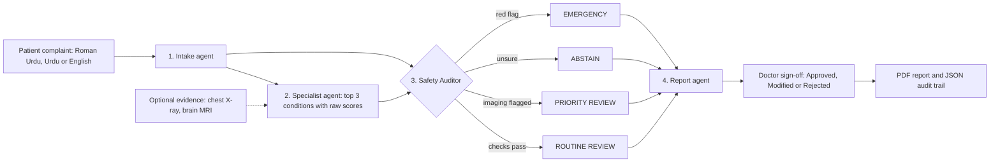

# Wary

**Roman Urdu health triage agents that know when not to answer.**

Wary is a multi-agent health triage prototype built for the Pak Angels GenAI & Agentic AI Hackathon (Cohort 11, Health Care). It reads a complaint written in Roman Urdu, Urdu or English, runs it through four agents, and returns a cautious screening result, an abstention, or an emergency escalation. A doctor signs off on every case.

> Wary is a research prototype and a screening aid. It is not a diagnosis tool and must not be used for real medical decisions.

## Contents

1. [Problem](#problem)
2. [Solution](#solution)
3. [Flow diagram](#flow-diagram)
4. [The four agents](#the-four-agents)
5. [Safety design](#safety-design)
6. [Safety Lab](#safety-lab)
7. [Run it](#run-it)
8. [Repository layout](#repository-layout)
9. [Limitations](#limitations)
10. [Roadmap](#roadmap)

## Problem

- Health chatbots can sound confident when they are wrong. An independent 2026 evaluation reported in Nature Medicine found that ChatGPT Health under-triaged more than half of the cases it was given (as reported by The Guardian, 26 Feb 2026).
- Most tools are built for English, while many people in Pakistan write symptoms in Roman Urdu or mixed Urdu and English.
- Most symptom checkers leave no audit trail, so a clinician cannot see why a decision was made.

## Solution

Wary puts a Safety Auditor between the model and the patient. The auditor is allowed to say "I should not answer this". Emergencies are caught by deterministic rules, uncertain cases are not guessed, and every case ends with a doctor sign-off and an audit trail.

Wary evolved from my earlier project ClarityMed (chest X-ray, brain MRI and symptom models). Those classifiers are reused. The agent layer, Safety Auditor, Safety Lab, audit trail and the interface are new work for this hackathon.

## Flow diagram



## The four agents

| # | Agent | What it does |
|---|---|---|
| 1 | Intake | Roman Urdu, Urdu or English text to structured symptoms (rule lexicon, optional Gemini refinement) |
| 2 | Specialist | Symptom model returns the top 3 conditions with raw scores. X-ray and MRI modules (Grad-CAM) add optional evidence |
| 3 | Safety Auditor | Deterministic checks: emergency red flags, low confidence, close calls, thin information, age risk, flagged imaging. Output: EMERGENCY, ABSTAIN, PRIORITY REVIEW or ROUTINE REVIEW |
| 4 | Report | Roman Urdu patient message and English doctor handoff note |

## Safety design

- Red flags are detected by rules, never by an LLM.
- Emergency and abstain messages are fixed templates.
- When the decision is EMERGENCY or ABSTAIN, the predicted condition is hidden from the patient.
- Stricter confidence threshold for age under 5 and 65 and above.
- Scores are shown as raw model scores, not calibrated probabilities.

## Safety Lab

- Adjustable abstention threshold
- Red-flag self-test: 30 hand-written Roman Urdu, Urdu and English cases, with negations. This is a demo check, not a clinical validation.
- Risk-coverage curve on the held-out symptom test set

<!-- Add screenshots here after you save them in docs/screenshots/, for example:


-->

## Run it

1. Open `Wary.ipynb` in Google Colab (GPU recommended for the imaging models).
2. Run the cells that train or load the symptom, chest X-ray and brain MRI models.
3. Run `src/wary_agents.py` as one cell, then `src/wary_app.py` as the next cell. This launches the Gradio app.
4. Optional: add `GEMINI_API_KEY` in Colab Secrets. Never put keys in code. Without it Wary falls back to rules.

## Repository layout

```
wary/
  README.md
  requirements.txt
  Wary.ipynb            training and evaluation notebook
  src/
    wary_agents.py      Intake, Specialist, Safety Auditor, Report, self-test
    wary_app.py         Gradio interface
  docs/
    PRD.pdf             product requirements document
    screenshots/
```

## Limitations

- Prototype, not validated on real patient data.
- The symptom model is trained on an English public dataset, so Roman Urdu support depends on a limited lexicon.
- Red-flag rules are keyword based and can miss unusual phrasing.
- Model scores are raw, not calibrated.

## Roadmap

1. Evaluate on a larger Roman Urdu health-query benchmark with an emergency category
2. Doctor-reviewed red-flag lexicon
3. Calibrated scores and age-specific thresholds
4. Hugging Face Spaces deployment
5. Voice input

## Author

Aila Nasir. Built with Python, scikit-learn, PyTorch, Gemini and Gradio.
